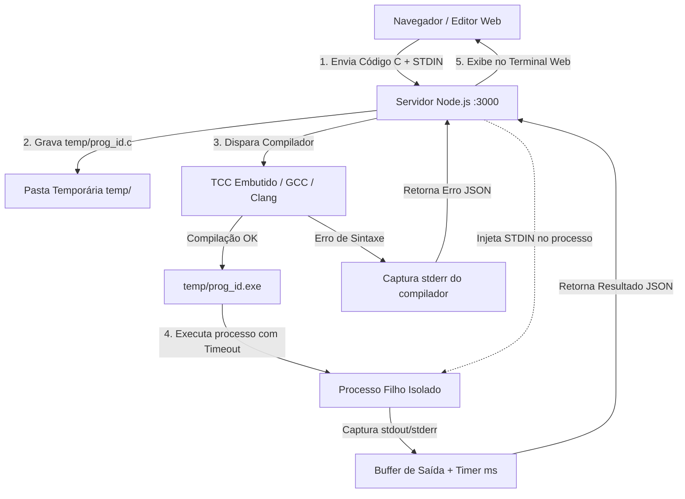

# 🚀 C-Studio — Compilador & Playground C

<div align="center">

-00599C?style=for-the-badge&logo=c&logoColor=white)


<p align="center">
  <strong>Ambiente web interativo para programar, compilar, executar e exportar programas em linguagem C diretamente pelo navegador — com compilador integrado e zero dependências externas no Node.js.</strong>
</p>

[Funcionalidades](#-funcionalidades) •
[Arquitetura](#-arquitetura-do-projeto) •
[Como Executar](#-como-executar) •
[Modelos Inclusos](#-modelos-e-exemplos-inclusos) •
[Estrutura](#-estrutura-do-repositório) •
[Licença](#-código-aberto-e-uso-100-gratuito)

</div>

---

## 📌 Sobre o Projeto

O **C-Studio** é um ambiente de desenvolvimento e aprendizado em C criado para eliminar todas as barreiras de configuração de compiladores. 

Em vez de exigir a instalação manual de IDEs pesadas ou configuração de variáveis de ambiente do sistema, o **C-Studio** oferece um fluxo direto e instantâneo:

1. **Pronto para Uso Imediato**: No Windows, inclui o compilador ultrarrápido **Tiny C Compiler (TCC)** já embutido na pasta `compiler/tcc/`. No Linux ou macOS, detecta e utiliza automaticamente o **GCC**, **Clang** ou **TCC** presente no sistema.
2. **Servidor Node.js 100% Nativo**: Não requer execução de `npm install` (zero dependências de terceiros), operando exclusivamente com os módulos padrão do Node.js (`http`, `child_process`, `fs`, `path`, `crypto`).
3. **Interface Web Moderna e Fluida**: Editor com numeração de linhas, atalhos de teclado, console estilo terminal escuro com suporte a **STDIN** (para `scanf()` e `fgets()`), importação/exportação de arquivos `.c` e download do executável `.exe` compilado.

---

## ✨ Funcionalidades

- ⚡ **Compilação Instantânea em C**: Escreva ou importe seu código e execute com feedback em tempo real.
- 📂 **Abertura e Salvamento de Arquivos C**:
  - **Abrir .C**: Carregue qualquer arquivo de código local do seu computador para o editor com um clique ou através de **Arrastar e Soltar (Drag & Drop)**.
  - **Salvar .C**: Baixe o código ativo diretamente em formato `.c` com nome contextual.
- 📦 **Download Direto do Executável (.EXE)**:
  - Botão **"Baixar .EXE"** que compila o código C ativo e gera um executável pronto para execução na máquina.
- 📥 **Suporte a Entrada Padrão Interativa (STDIN)**:
  - Aba dedicada para injetar valores consumidos por funções como `scanf()` e `fgets()`.
- ⏱️ **Métricas de Execução em Tempo Real**:
  - Tempo de execução medido em milissegundos (`ms`).
  - Código de saída do processo (`Exit Code 0`, erro de sintaxe, etc.).
  - Diferenciação visual entre saída padrão (`stdout`) e erros de compilação/execução (`stderr`).
- 🛡️ **Proteção contra Loops Infinitos**:
  - Timeout automático de segurança com encerramento forçado do processo filho (`taskkill` no Windows e sinal `SIGKILL` em Unix).
- 🚀 **Inicialização com 1 Clique no Windows**:
  - Arquivo `iniciar.bat` que inicia o servidor local e abre o navegador automaticamente na porta 3000.

---

## 🏗️ Arquitetura do Projeto

O fluxo de comunicação e execução do **C-Studio** opera de forma modular e segura:



---

## 📁 Estrutura do Repositório

```text
c-playground/
├── compiler/                     # Compilador portátil integrado
│   └── tcc/                      # Tiny C Compiler (TCC) para Windows (x86/x64)
│       ├── tcc.exe               # Executável do compilador
│       ├── include/              # Cabeçalhos padrão C (stdio.h, stdlib.h, etc.)
│       └── lib/                  # Bibliotecas de ligação
│
├── public/                       # Frontend web da aplicação
│   ├── index.html                # Estrutura visual com painéis divididos
│   ├── style.css                 # Estilização moderna escura com Glassmorphism
│   └── app.js                    # Editor, atalhos, templates e chamadas de API
│
├── temp/                         # Diretório de trabalho para arquivos temporários
├── server.js                     # Servidor HTTP nativo e orquestrador de compilação
├── iniciar.bat                   # Script de inicialização rápida para Windows
├── package.json                  # Metadados e scripts do projeto Node.js
├── .gitignore                    # Regras de exclusão para Git
├── LICENSE                       # Licença permissiva MIT
└── README.md                     # Documentação oficial
```

---

## 🚀 Como Executar

### Pré-requisitos
- **Node.js**: Versão 16 ou superior instalada ([Baixar Node.js](https://nodejs.org/)).
- **Compilador C**:
  - No **Windows**: Nenhuma instalação necessária! O compilador TCC já vem embutido em `compiler/tcc/`.
  - No **Linux / macOS**: O GCC ou Clang padrão do sistema é detectado automaticamente (`sudo apt install build-essential` ou `xcode-select --install`).

---

### Método 1: Inicialização Rápida no Windows (Recomendado)

Basta dar um duplo clique no arquivo:
```cmd
iniciar.bat
```
O script iniciará o servidor local e abrirá o seu navegador padrão em `http://localhost:3000`.

---

### Método 2: Via Terminal (Prompt de Comando, PowerShell, Linux ou macOS)

1. Acesse o diretório do repositório:
   ```bash
   cd c-playground
   ```

2. Inicie o servidor:
   ```bash
   node server.js
   ```
   *(ou `npm start`)*

3. Abra seu navegador e acesse:
   ```
   http://localhost:3000
   ```

---

## 📚 Modelos e Exemplos Inclusos

No menu suspenso **"📂 Exemplos Prontos..."** da barra superior, você encontra 6 modelos didáticos prontos para carregar e experimentar:

| # | Exemplo | Conceitos Abordados |
|---|---|---|
| **1** | **Olá Mundo** | Estrutura elementar de um programa C, biblioteca `<stdio.h>`, `printf()` e `main()`. |
| **2** | **Entrada com `scanf()`** | Leitura formatada de múltiplos tipos (`char[]`, `int`, `float`) e uso da aba STDIN. |
| **3** | **Vetores & Estatísticas** | Iteração de vetores numéricos, cálculo de soma, média aritmética, maior e menor elemento. |
| **4** | **Gestão de Dados & Arquivos** | Agrupamento de dados com `struct`, vetores de registros e persistência em disco via `fopen()`, `fprintf()` e `fclose()`. |
| **5** | **Sistema de Pedidos Simples** | Modelagem com `struct`, cálculo de subtotal e formatação tabular alinhada. |
| **6** | **Ponteiros & Troca de Valores** | Passagem de parâmetros por referência, operador de endereço (`&`) e desreferenciação (`*`). |

---

## ⌨️ Atalhos de Teclado

| Tecla de Atalho | Ação |
|---|---|
| <kbd>Ctrl</kbd> + <kbd>Enter</kbd> | Compilar e Executar o código C ativo |
| <kbd>Tab</kbd> | Inserir 4 espaços de indentação no editor |
| <kbd>Shift</kbd> + <kbd>Tab</kbd> | Recuar indentação da linha |

---

## 🛠️ Tecnologias Utilizadas

- **Linguagem C**: Padrões C99 / C11
- **Compiladores Suportados**: [Tiny C Compiler (TCC)](https://bellard.org/tcc/), GCC e Clang
- **Backend**: Node.js Nativo (`http`, `child_process`, `crypto`, `fs`, `path`)
- **Frontend**:
  - HTML5 Semântico e Acessível (`ARIA tabs`, papéis semânticos)
  - CSS3 Moderno (Variáveis de Tema, Glassmorphism, Flexbox, Grid)
  - JavaScript ES6+ (FileReader API, Blob/URL Download, Fetch API)
  - Tipografia: *Fira Code* (Código) e *Plus Jakarta Sans* (Interface)

---

## 📄 Código Aberto e Uso 100% Gratuito

Este projeto é **completamente gratuito e de código aberto (Open Source)**, distribuído sob os termos da licença permissiva **MIT**.

Qualquer pessoa tem total liberdade para:
- ✅ **Clonar, baixar e executar** o projeto livremente;
- ✅ **Estudar e modificar** o código-fonte para suas próprias necessidades e disciplinas acadêmicas;
- ✅ **Utilizar como base** para novos ambientes, ferramentas didáticas e trabalhos;
- ✅ **Compartilhar** com amigos, estudantes e desenvolvedores.

---

<div align="center">
  Desenvolvido com foco em simplicidade, produtividade e acessibilidade no ensino da linguagem C.
</div>
