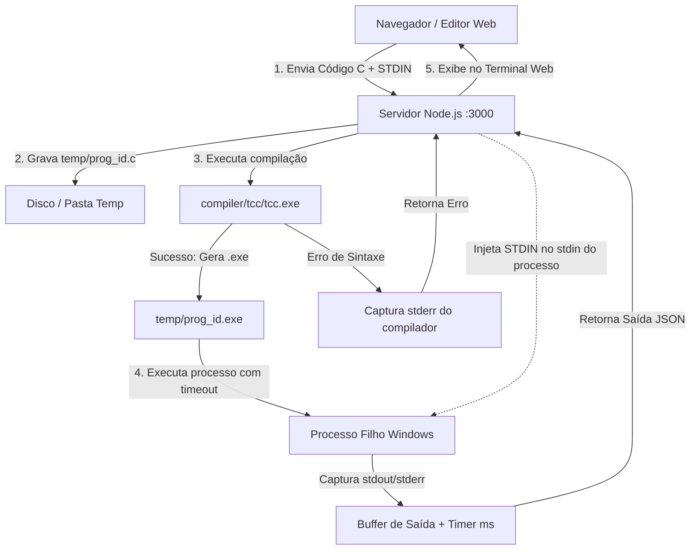

# 🚀 C-Studio — Compilador & Playground C

<div align="center">

-00599C?style=for-the-badge&logo=c&logoColor=white)

-blueviolet?style=for-the-badge)


<p align="center">
  <strong>Ambiente web local e interativo para programar, compilar, executar e exportar programas em linguagem C diretamente pelo navegador — com compilador nativo integrado e zero dependências externas pesadas.</strong>
</p>

[Funcionalidades](#-funcionalidades) •
[Sistema de Restaurante](#-sistema-prático-incluso-restaurante_vetorc) •
[Arquitetura](#-arquitetura-do-projeto) •
[Como Executar](#-como-executar) •
[Exemplos Prontos](#-modelos-e-exemplos-inclusos) •
[Estrutura](#-estrutura-do-repositório)

</div>

---

## 📌 Sobre o Projeto

O **C-Studio** é uma solução completa desenvolvida para eliminar todo o atrito de configuração de ambientes de desenvolvimento em **C**. Em vez de instalar IDEs volumosas (como Code::Blocks ou Visual Studio) ou configurar manualmente variáveis de ambiente para MinGW/GCC, o **C-Studio** oferece:

1. **Compilador TCC (Tiny C Compiler) embarcado**: Um compilador C nativo ultrarrápido, capaz de compilar e ligar binários Windows em frações de segundo.
2. **Servidor Node.js 100% nativo**: Não requer instalação de pacotes via `npm install` (zero dependências externas), utilizando apenas os módulos da biblioteca padrão do Node.js (`http`, `child_process`, `fs`, `path`, `crypto`).
3. **Interface Web Moderna**: Editor com numeração de linhas, console estilo terminal escuro com suporte completo a **STDIN** (para `scanf()` e `fgets()`), atalhos de teclado e exportação do executável `.exe` para a sua máquina.
4. **Projeto Prático Incluso**: Acompanha o `restaurante_vetor.c`, um sistema completo de gestão de comandas e restaurante documentado didaticamente linha a linha.

---

## ✨ Funcionalidades

- ⚡ **Compilação Instantânea em C**: Escreva seu código e veja o resultado na hora com o Tiny C Compiler (TCC v0.9.27).
- ⌨️ **Editor de Código Completo**:
  - Numeração dinâmica de linhas e sincronização de rolagem.
  - Indentação automática com tecla `Tab`.
  - Atalho rápido de execução com <kbd>Ctrl</kbd> + <kbd>Enter</kbd>.
  - Botão de cópia rápida para área de transferência e limpeza com um clique.
- 📥 **Suporte a Entrada Padrão (STDIN)**:
  - Aba dedicada para fornecer dados que seu programa lê através de `scanf()` ou `fgets()`.
  - Suporta leituras simples e múltiplos parâmetros em sequência.
- 📦 **Download Direto do Executável (.EXE)**:
  - Botão **"Baixar .EXE"** que compila o código C ativo no editor e entrega um binário `.exe` portátil pronto para rodar nativamente no Windows.
- ⏱️ **Métricas de Execução em Tempo Real**:
  - Indicação do tempo de execução em milissegundos (`ms`).
  - Código de retorno do processo (`Exit Code 0`, `-1`, etc.).
  - Distinção visual clara entre saídas padrão (`stdout`) e mensagens de erro do compilador (`stderr`).
- 🛡️ **Proteção contra Loops Infinitos**:
  - Timeout automático de segurança com encerramento forçado do processo filho no Windows via `taskkill`, impedindo congelamento do servidor.
- 🚀 **Inicialização Rápida em 1 Clique**:
  - Arquivo `iniciar.bat` que inicia o servidor local e abre o navegador automaticamente na porta correta.

---

## 🍔 Sistema Prático Incluso: `restaurante_vetor.c`

O repositório inclui um exemplo prático completo e rigorosamente comentado em português, demonstrando o uso avançado e seguro de vetores em C:

### Destaques do Código:
- **Modelagem com `struct`**: Estrutura `Pedido` com identificador sequencial único, nome do cliente, descrição dos itens e status do pedido.
- **Vetor com Capacidade Controlada**: Uso de constantes `#define CAPACIDADE_MAXIMA 100` para evitar estouro de pilha.
- **Tratamento de Buffer e Strings Seguras**: Implementação da função `limparBufferEntrada()` e uso de `fgets()` combinado com `strcspn()` para eliminar o `\n` e evitar bugs clássicos de leitura em C.
- **Operações Fundamentais de Vetores**:
  - Inserção sequencial na cauda do vetor (`O(1)`).
  - Listagem geral formatada com status legível (Aguardando / Em Preparo / Entregue).
  - Busca sequencial por ID com retorno de índice.
  - Remoção de elementos com reorganização de memória (*shift* / deslocamento à esquerda de posições).
- **Persistência de Dados**: Gravação e exportação do resumo diário diretamente para o arquivo [`historico_pedidos_do_dia.txt`](./historico_pedidos_do_dia.txt) usando `fopen()`, `fprintf()` e `fclose()`.

---

## 🏗️ Arquitetura do Projeto

O fluxo de comunicação e execução do C-Studio funciona da seguinte maneira:



---

## 📁 Estrutura do Repositório

```text
c-playground/
├── compiler/                     # Binários do Tiny C Compiler (TCC)
│   └── tcc/                      # Compilador C nativo para Windows (x86/x64)
│       ├── tcc.exe               # Executável do compilador
│       ├── include/              # Cabeçalhos padrão C (stdio.h, stdlib.h, etc.)
│       └── lib/                  # Bibliotecas estáticas de ligação
│
├── public/                       # Frontend web do C-Studio
│   ├── index.html                # Estrutura da interface com split pane
│   ├── style.css                 # Estilização moderna escura com Glassmorphism
│   └── app.js                    # Editor, atalhos, templates e chamadas à API
│
├── temp/                         # Diretório de trabalho para arquivos temporários (.c e .exe)
├── historico_pedidos_do_dia.txt  # Histórico gerado pelo sistema de restaurante
├── restaurante_vetor.c           # Código-fonte didático completo do restaurante em C
├── restaurante_vetor.exe         # Binário compilado do sistema de restaurante
├── server.js                     # Servidor HTTP e orquestrador do compilador TCC
├── iniciar.bat                   # Script de execução rápida para Windows
├── package.json                  # Metadados do projeto Node.js
└── README.md                     # Documentação oficial do projeto
```

---

## 🚀 Como Executar

### Pré-requisitos
- **Sistema Operacional**: Windows 10 ou 11 (64-bit)
- **Node.js**: Versão 16 ou superior instalada ([Baixar Node.js](https://nodejs.org/))

> [!NOTE]
> O compilador C já vem incluído na pasta `compiler/tcc/`! Você **não** precisa instalar GCC, MinGW nem Visual Studio.

---

### Método 1: Inicialização em 1 Clique (Recomendado)

Basta dar um **duplo clique** no arquivo:
```cmd
iniciar.bat
```
O script iniciará o servidor Node.js e abrirá automaticamente o navegador em `http://localhost:3000`.

---

### Método 2: Via Terminal (Prompt de Comando ou PowerShell)

1. Clone ou acesse a pasta do repositório:
   ```bash
   cd c-playground
   ```

2. Inicie o servidor:
   ```bash
   node server.js
   ```
   *(ou `npm start`)*

3. Abra o seu navegador e acesse:
   ```
   http://localhost:3000
   ```

---

## 📚 Modelos e Exemplos Inclusos

No menu suspenso **"📂 Exemplos Prontos..."** da barra superior, você encontra 6 modelos prontos para carregar e testar com um único clique:

| # | Exemplo | Conceitos Abordados |
|---|---|---|
| **1** | **Olá Mundo** | Estrutura básica de um programa em C, `printf()` e `main()`. |
| **2** | **Entrada com `scanf()`** | Leitura formatada de múltiplos tipos (`char[]`, `int`, `float`) e uso da aba STDIN. |
| **3** | **Vetores & Estatísticas** | Iteração de vetores, cálculo de soma, média aritmética, maior e menor valor. |
| **4** | **Restaurante Fast Food** | Código completo com structs, vetores, remoção com deslocamento de memória e exportação de arquivo. |
| **5** | **Sistema de Pedidos Simples** | Modelagem com `struct`, cálculo de total e formatação tabular. |
| **6** | **Ponteiros & Troca de Valores** | Passagem por referência, desreferenciação (`*`) e operador de endereço (`&`). |

---

## ⌨️ Atalhos de Teclado

| Tecla de Atalho | Ação |
|---|---|
| <kbd>Ctrl</kbd> + <kbd>Enter</kbd> | Compilar e Executar o código C imediatamente |
| <kbd>Tab</kbd> | Inserir 4 espaços de indentação no editor |
| <kbd>Shift</kbd> + <kbd>Tab</kbd> | Remover indentação de linha |

---

## 🛠️ Tecnologias Utilizadas

- **Linguagem C**: Padrões C99 / C11
- **Compilador C**: [Tiny C Compiler (TCC)](https://bellard.org/tcc/) por Fabrice Bellard
- **Backend**: Node.js puro (`http`, `child_process`, `crypto`, `fs`)
- **Frontend**:
  - HTML5 Semântico com acessibilidade (`ARIA tabs`, `roles`)
  - CSS3 Moderno (Variáveis CSS, Dark Palette, Glassmorphism, Flexbox, Grid)
  - JavaScript ES6+ (Fetch API, eventos de teclado, manipulação do DOM)
  - Fontes: *Fira Code* (Mono/Código) e *Plus Jakarta Sans* (Interface)

---

## 📄 Licença

Este projeto é distribuído sob a licença **MIT**. Consulte o arquivo de licença para obter mais detalhes.

---

<div align="center">
  Desenvolvido com foco em produtividade, ensino e alta performance em C.
</div>
